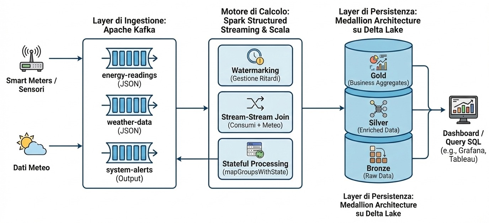

# London Energy Pulse: Piattaforma di Streaming Analytics per Smart City

**London Energy Pulse** è una piattaforma di **Streaming Analytics** e **Anomaly Detection** progettata per il monitoraggio in tempo reale delle Smart Grids urbane. Utilizzando il dataset *LCL (London DataStore)*, il sistema trasforma letture energetiche statiche in flussi di dati intelligenti, integrando variabili meteorologiche per rilevare anomalie di consumo.

---

## 🚀 Panoramica del Progetto

L'obiettivo è superare i limiti delle analisi batch tradizionali, implementando una pipeline reattiva capace di:

* **Ingestione Real-time**: simulazione di migliaia di Smart Meter tramite Apache Kafka.
* **Data Enrichment**: join dinamico tra flussi di consumo e dati meteo.
* **Stateful Analysis**: monitoraggio del profilo storico dell'utente per il rilevamento di guasti o picchi anomali.
* **Data Lakehouse**: archiviazione sicura e transazionale tramite Medallion Architecture su Delta Lake.

---

## 🏗️ Architettura del Sistema

Il progetto adotta un modello **decoupled (disaccoppiato)** per garantire scalabilità e resilienza:

1. **Layer di Ingestione (Kafka)**: funge da buffer intelligente gestendo la *backpressure*. Topic: `energy-readings`, `weather-data`, `system-alerts`.
2. **Motore di Calcolo (Spark Structured Streaming & Scala)**: esegue operazioni critiche come *Watermarking* (gestione ritardi), *Stream-Stream Join* e *Stateful Processing*.
3. **Layer di Persistenza (Delta Lake)**: organizzazione dei dati in livelli:
   * **Bronze**: dati grezzi (Raw).
   * **Silver**: dati puliti e arricchiti.
   * **Gold**: aggregazioni business-ready per dashboard (Grafana/Tableau).



---

## 📊 Dataset e 📜 Licenza

Questo progetto utilizza il dataset **Smart Meters in London**, raccolto nell’ambito del progetto *Low Carbon London*.

Fonte del dataset:
Smart Meters in London – disponibile su Kaggle
[https://www.kaggle.com/datasets/jeanmidev/smart-meters-in-london](https://www.kaggle.com/datasets/jeanmidev/smart-meters-in-london)

Fornitore originale dei dati:
[https://data.london.gov.uk/dataset/smartmeter-energy-consumption-data-in-london-households-vqm0d/](https://data.london.gov.uk/dataset/smartmeter-energy-consumption-data-in-london-households-vqm0d/)


Il dataset è distribuito secondo la licenza **Open Data Commons Open Database License (ODbL) v1.0**.
I dati sono utilizzati esclusivamente per finalità accademiche e didattiche.
Questo repository **non redistribuisce il dataset originale**.
Per riprodurre i risultati è necessario scaricare i dati direttamente dalla fonte ufficiale.

#### 📥 Download e preparazione dei dati
Per replicare il progetto è necessario scaricare manualmente i dati dalla pagina Kaggle:
[https://www.kaggle.com/datasets/jeanmidev/smart-meters-in-london](https://www.kaggle.com/datasets/jeanmidev/smart-meters-in-london)

##### File necessari
Scaricare i seguenti file:
* **`halfhourly_dataset.zip`**
* **`informations_households.csv`**
* **`weather_hourly.csv`**

Dopo aver scaricato i file, creare una cartella denominata:
```
data/
```
All’interno della cartella `data` inserire:
```
data/
│
├── halfhourly_dataset
    ├── block_0.csv
    ├── block_1.csv
    ├── block_2.csv
    └── ...
├── informations_households.csv
└── weather_hourly.csv
```

**Nel codice è necessario impostare correttamente il percorso relativo alla cartella `data`.**
Sostituire il percorso assoluto con il percorso corretto della propria macchina.


---

## ⚙️ Configurazione Kafka & IntelliJ IDEA

Il progetto utilizza **Apache Kafka** come broker di messaggistica. La gestione e il monitoraggio dei flussi avvengono direttamente tramite l'integrazione con **IntelliJ IDEA**.

### 1. Avvio dei Servizi Kafka

Assicurati che Kafka sia installato ed eseguito localmente:

* **macOS (Homebrew)**:
  `brew services start kafka`
* **Windows**:
  Eseguire i file `.bat` per Zookeeper e Kafka dalla cartella `bin\windows\`.

### 2. Integrazione con IntelliJ (Big Data Tools)

Per monitorare i dati graficamente senza usare il terminale:

1. **Connessione**: apri il pannello **Big Data Tools**, aggiungi un servizio **Kafka** e punta a `localhost:9092`.
2. **Ispezione**: seleziona il topic `energy-readings` il quale mostra una tabella con il conteggio dei messaggi letti.
3. **Visualizzazione JSON**:
   * Clicca sull'icona dell'**ingranaggio** (Consumer Settings).
   * Clicca su `Start Consuming`.
   * Ora i messaggi appariranno come testo JSON leggibile invece di byte grezzi.

### 3. Workflow di Ingestione

* **Producer**: esegui `EnergyProducer.scala` per leggere i CSV e inviare JSON a Kafka.
* **Validazione**: verifica l'incremento dei messaggi e il contenuto dei JSON nella tabella del plugin Big Data Tools.

---

## 🛠️ Tech Stack & Dipendenze

* **Linguaggio**: Scala 2.12.18
* **Build Tool**: SBT 1.9.8
* **Processing**: Apache Spark 3.5.7
* **Broker**: Apache Kafka (Installazione nativa)
* **Storage**: Delta Lake 3.1.0

#### Configurazione `build.sbt`

```scala
libraryDependencies ++= Seq(
  // Core Spark
  "org.apache.spark" %% "spark-core" % "3.5.7",
  "org.apache.spark" %% "spark-sql" % "3.5.7",
  "org.apache.spark" %% "spark-mllib" % "3.5.7",
  "org.apache.spark" %% "spark-streaming" % "3.5.7",

  // KAFKA: Il connettore per Spark (Consumer) e il client nativo (Producer)
  "org.apache.spark" %% "spark-sql-kafka-0-10" % "3.5.7",
  "org.apache.kafka" % "kafka-clients" % "3.7.0", // per il Producer Kafka

  // DELTA LAKE: Gestione Silver Layer
  "io.delta" %% "delta-spark" % "3.1.0",

  // JSON: Parsing per i messaggi nel topic
  "com.fasterxml.jackson.module" %% "jackson-module-scala" % "2.15.2",

  // LOGGING
  "ch.qos.logback" % "logback-classic" % "1.4.14"
)

```

## 📋 Requisiti
Per eseguire il progetto localmente è necessario:

1. **Java JDK 11** configurato nel `JAVA_HOME`.
2. **Apache Kafka & Zookeeper** avviati localmente.
3. **IntelliJ IDEA** con il plugin Scala installato.